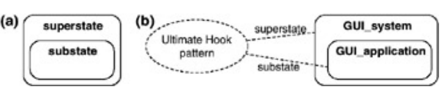

# Ultimate Hook

The "Ultimate Hook" paradigm arises from the need to give developers full freedom without sacrificing the standardization of a system (e.g., Windows).
The solution offered is a system where all interactions have a default way of being handled, but that default is not executed as the standard first response.
The name is quite evocative: a "Hook" in computer science is a point where you can "hang" your custom code within an existing flow. The "Ultimate Hook" is the ultimate hook because it doesn't concern just a small function, but the entire lifecycle of the application.
The **developer** is given the opportunity to handle the event through code, and only if the event is not handled by the developer do we fall back to the standard handling.

For events like a mouse click on a window, this paradigm creates an event hierarchy of this kind:
- The event originates in the Operating System, which detects machine inputs
- The system checks whether the application handles this interaction
- The application decides whether to intercept the event with custom logic or ignore it, letting the default handling bubble back up toward the operating system (fall-through mechanism)

## Programming by Difference

This paradigm (used by both mobile and desktop operating systems) allows the developer to avoid rewriting basic event-handling code every time — such as the code for dragging a window or minimizing it to the taskbar. This concept is closely tied to the principle of **Default Behavior** and drastically reduces **Boilerplate code**, meaning all that repetitive code not specific to the application's logic that would otherwise be necessary just to make it run.
The only events for which code must be written are those that need to be handled in a custom way within the application.
The handling of all unimplemented events will be passed to the operating system, which will manage them in a default manner — as if the system were a predefined template and you only intervene when you want to modify a specific behavior.

## Practical Examples

"Programming by Difference" manifests in a very concrete and recognizable way in two historically relevant contexts: native Windows applications (Win32) and Android applications. Despite syntactic and architectural differences, both systems express the same logical structure: the developer explicitly handles only the events they care about, and for everything else explicitly delegates to the system's default behavior.

### Win32 WndProc in C

In Win32, every window is associated with a **Window Procedure** (`WndProc`): a callback function that the operating system calls every time an event occurs on the window (click, resize, close, etc.).

The developer implements this function by intercepting only the messages relevant to their application. All unhandled messages are passed to `DefWindowProc`, i.e., Windows' default procedure, which represents the hierarchical fallback described in the paradigm.

> The `return 0` signals to the system that the event has been **consumed** by the application and should not be propagated further. The call to `DefWindowProc` is instead the explicit **fall-through**: the application gives up handling and lets the system take its course.

::::{tab-set}
:::{tab-item} C
```c
LRESULT CALLBACK WndProc(HWND hwnd, UINT msg, WPARAM wParam, LPARAM lParam) {
    switch (msg) {

        case WM_LBUTTONDOWN:
            // Intercepted event: application's custom logic
            MyApp_HandleClick(wParam, lParam);
            return 0; // Event consumed: not propagated to the system

        case WM_DESTROY:
            // We also intercept the close event to clean up resources
            MyApp_Cleanup();
            PostQuitMessage(0);
            return 0;

        // WM_MOVE, WM_SIZE, WM_PAINT and all other messages
        // are not listed: they will fall through to the default below
    }

    // Fall-through: everything we haven't handled
    // is delegated to Windows' standard behavior
    return DefWindowProc(hwnd, msg, wParam, lParam);
}
```
:::
:::{tab-item} Java (equivalent approach)
```java
// In pure Java (AWT/Swing) the same pattern is expressed
// through a WindowAdapter, which provides empty default
// implementations for all window events.
// The developer overrides only what they need.

frame.addWindowListener(new WindowAdapter() {

    @Override
    public void mouseClicked(MouseEvent e) {
        // Intercepted event: application's custom logic
        myApp.handleClick(e);
        // We don't call super: the event is consumed here
    }

    @Override
    public void windowClosing(WindowEvent e) {
        // We also intercept the close event to clean up resources
        myApp.cleanup();
        frame.dispose();
    }

    // All other methods (windowOpened, windowIconified, etc.)
    // are not overridden: WindowAdapter handles them
    // with an empty body, equivalent to Win32's DefWindowProc
});
```
:::
::::

---

### Android onTouchEvent in Kotlin/Java

In Android the paradigm is expressed through OOP inheritance. Every visual component (`View`) has a set of event-handling methods already implemented in the base class. The developer extends the class and **overrides** only the methods corresponding to the events they want to handle in a custom way.

The fall-through is not a call to a system function like `DefWindowProc`, but a call to `super.onTouchEvent()`: it explicitly delegates to the behavior defined by the parent class in the inheritance hierarchy.

> The `return true` indicates that the event has been **consumed** by the current component. The `return super.onTouchEvent(event)` is the **fall-through**: the component gives up handling and passes it up to the higher level of the hierarchy, exactly as happens in Harel's statecharts with event bubbling toward the super-state.

::::{tab-set}
:::{tab-item} Kotlin
```kotlin
class MyView(context: Context) : View(context) {

    override fun onTouchEvent(event: MotionEvent): Boolean {
        if (event.action == MotionEvent.ACTION_DOWN) {
            // Intercepted event: component's custom logic
            myCustomLogic()
            return true // Event consumed: does not bubble up to the parent View
        }

        // Fall-through for all other event types:
        // delegates to the base class's default behavior
        return super.onTouchEvent(event)
    }

    // onDraw(), onMeasure(), onLayout() and all other methods
    // are not overridden: the base View class handles them
    // with Android's standard behavior
}
```
:::
:::{tab-item} Java
```java
public class MyView extends View {

    public MyView(Context context) {
        super(context);
    }

    @Override
    public boolean onTouchEvent(MotionEvent event) {
        if (event.getAction() == MotionEvent.ACTION_DOWN) {
            // Intercepted event: component's custom logic
            myCustomLogic();
            return true; // Event consumed: does not bubble up to the parent View
        }

        // Fall-through for all other event types:
        // delegates to the base class's default behavior
        return super.onTouchEvent(event);
    }

    // onDraw(), onMeasure(), onLayout() and all other methods
    // are not overridden: the base View class handles them
    // with Android's standard behavior
}
```
:::
::::

---

### The Common Pattern

In both examples the logical structure is identical, expressed with two different syntaxes:

| | Win32 (C) | Android (Kotlin/Java) |
|---|---|---|
| **Entry point** | `WndProc` (system callback) | `onTouchEvent` (base class method) |
| **Event consumed** | `return 0` | `return true` |
| **Fall-through to default** | `DefWindowProc(...)` | `super.onTouchEvent(...)` |
| **Who defines the default** | The Windows operating system | Android's `View` class |
| **Direction of hierarchy** | System → Application (descends) | Subclass → Superclass (ascends) |

The direction is opposite, but the principle is the same: there is always a **higher level** that knows the default behavior, and the developer can choose whether to intervene or delegate.

## Application to Harel's Statecharts

This paradigm can also be applied to state machines.
Imagine having a state machine that needs to handle a "stop" event inside every state. According to classical state machine logic, each state would be treated as a self-contained finite state and thus the stop would need to be handled with an arrow leaving every single state.
With hierarchy instead, it is enough to:
- Create a Super-State that contains all the other states
- Define the stop-handling rule inside the Super-State
- States defined inside the Super-State will automatically inherit the rule if it is not handled within the sub-states themselves

This mechanism is called **Event Bubbling**: if an event finds no handler in the current sub-state, it automatically bubbles up to the super-state. It is worth noting that the direction is opposite to the Windows model (where the system "descends" toward the application), but the hierarchical delegation logic is identical.



It is of course possible for a substate to act as a superstate for another substate nested within it, enabling the creation of multiply-nested states.