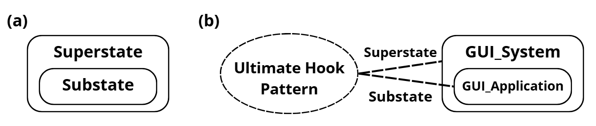

# Ultimate Hook

Il paradigma dell' "Ultimate Hook" nasce dalla necessità di dare piena libertà al programmatore senza però andare a rinunciare in nessun modo alla standardizzazione di un sistema (es. Windows).
La soluzione offerta è un sistema dove tutte le interazioni hanno un modo di default con le quali possono essere gestite ma che non viene eseguito come standard.
Il nome è molto evocativo: un "Hook" (gancio) in informatica è un punto in cui puoi "appendere" il tuo codice personalizzato all'interno di un flusso già esistente. L' "Ultimate Hook" è il gancio definitivo perché non riguarda solo una piccola funzione, ma l'intero ciclo di vita dell'applicazione.
Infatti si dà la possibilità al **programmatore** di gestire l'evento tramite codice e solo se l'evento non è gestito dal programmatore abbiamo un fallback sulla gestione standard.

Per eventi come il click del mouse su una finestra questo paradigma crea una gerarchia degli eventi di questo tipo:
- L'evento nasce nel Sistema Operativo che rileva gli input della macchina
- Il sistema controlla se l'applicazione gestisce questa interazione
- L'applicazione decide se intercettare l'evento con una logica personalizzata o se ignorarlo, lasciando che la gestione di default risalga verso il sistema operativo (meccanismo di fall-through)

## Programming by difference

Questo paradigma (Utilizzato da sistemi operativi mobile e PC) permette al programmatore di non dover scrivere ogni volta codici basilari di gestione di eventi come il codice per trascinare la finestra o per ridurre ad icona. Questo concetto è strettamente legato al principio di **Default Behavior** (Comportamento predefinito) e riduce drasticamente il **Boilerplate code**, ovvero tutto quel codice ripetitivo e non specifico alla logica dell'applicazione che sarebbe altrimenti necessario per farla semplicemente funzionare.
Gli unici eventi per il quale si deve scrivere del codice sono gli eventi per i quali vogliamo gestire in modo custom all'interno della nostra applicazione.
La gestione di tutti gli eventi non implementati verrà passata al sistema operativo che li gestirà in maniera di default, come se il sistema fosse un modello predefinito e tu intervenissi solo quando vuoi modificare una funzionalità.

## Applicazione agli statecharts di Harel
Questo paradigma può essere applicato anche alle macchine a stati.
Immaginando di avere una macchina a stati che deve gestire all'interno di ogni stato un evento di "stop", secondo la logica delle macchine a stati classica andrebbe considerato ogni stato come stato finito a se e quindi gestire lo stop con una freccia che parte da ogni stato.
Con la gerarchia invece basta:
- Creare un Super-Stato che contiene tutti gli altri stati
- Definire la regola di gestione dello stop all'interno del Super-Stato
- Gli stati definiti all'interno del Super-Stato andranno ad ereditare la regola automaticamente se non gestita all'interno dei sotto-stati stessi

Questo meccanismo prende il nome di **Event Bubbling** (risalita degli eventi): se un evento non trova un gestore nel sotto-stato corrente, risale automaticamente al super-stato. Vale la pena notare che la direzione è opposta rispetto al modello Windows (dove il sistema "scende" verso l'applicazione), ma la logica gerarchica di delega è identica.

Ovviamente è possibile che un substate sia considerato superstate per un altro substate al suo interno dando la possibilità di creare degli stati innestati più di una volta.